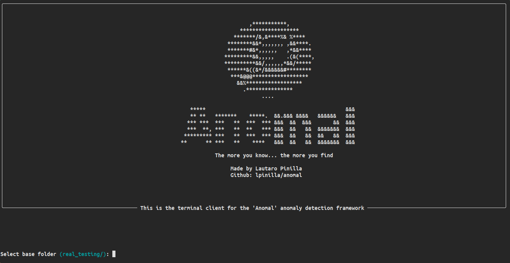
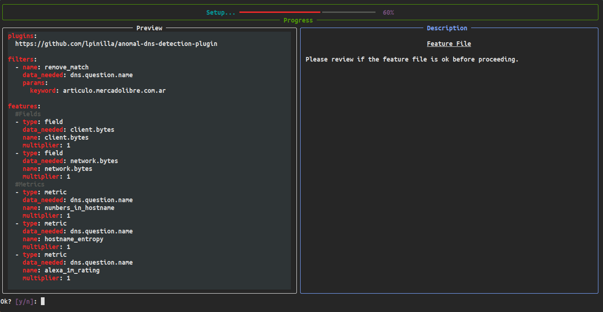

<h1 align="center"> Anomal Framework </h1>
<div align="center">

</div>

The Anomal Framework is a system to aid defenders to detect anomalies on any signal they want. It's designed to be modular, easy to use, and composable.


[video1]

# Why?

Existing similar frameworks are either expensive, not easy to use, and may even hide from you how they detect stuff.

This framework is meant to be plug-and-play and transparent.

### Some key benefits are

* Modular 🧩
* Easy to use (docker image available 🐳)
* Portable (made in python3) 🐍
* Plugin system 🔌
* Useful report dashboard to help you analyze the results 📓

# Table of Contents

1. [How does it work](#How-does-it-work)
2. [The TUI](#The-TUI)
2. [The Report](#The-Report)
3. [Install](#Install)
4. [Examples](#Examples)

# How does it work

You can analyze every dataset you want. **YOU** define what's normal and what's not.

The system is composed of three different modules or "engines".

* Feature Engine
* Classification Engine
* Report Engine

### Settings via YAML

You can specify the system settings in a `yaml` file.

```yaml
data:
  in_path: dns_logs_example.csv
  out_path: results.csv
features:
  path: dns_features.yaml
setup:
  classification_engine: Gower
  input_driver: CSV
  output_driver: CSV
```

### Feature Engine 📝

The Feature Engine allows you to create a new dataset based on the fields you want from the original source and custom metrics you build on top of it.

**You can define your own features/metrics that you distinguish normal from abnormal data on your dataset and give each feature its corresponding importance.**

Here is a short version of the example provided in `example/dns_features.yaml`:

```yaml
#Using a plugin that has useful metrics to detect dns anomalies
plugins:
  https://github.com/lpinilla/anomal-dns-detection-plugin

features:
  #Fields
  - type: field
    data_needed: client.bytes
    name: client.bytes
    multiplier: 1
  - type: field
    data_needed: network.bytes
    name: network.bytes
    multiplier: 1
  #Metrics
  - type: metric
    data_needed: dns.question.name
    name: numbers_in_hostname
    multiplier: 1
  - type: metric
    data_needed: dns.question.name
    name: hostname_entropy
    multiplier: 1

flags:
    severity: medium
  - type: aggregation
    name: beaconing_detector
    data_needed: source.ip,@timestamp
    description: This detector is used to discover beaconing behavior
    severity: low
    params:
      client_ip: source.ip
      timestamp: "@timestamp"
      threshold: 0.7
```

### Classification Engine 🕵

The Classification Engine is in charge of applying the selected Machine Learning method to classify the dataset provided by the Feature Engine and produces a simple classification.

### Report Engine 📈

The Report Engine displays all the results on a simple web page.

## Data Integration 🔌

Data can be received and exported via the `data drivers`. You can load data from a `csv` or whatever format you want while you create its corresponding driver. You can even export data to `elasticsearch` if you prefer to visualize the results on `kibana` by using the corresponding data output driver.

## Modularity 🧩

The Classification Engine and the Report can be changed to fit your needs.

* Do you want to export the results to a pdf? Just use a PDF Report Engine instead.
* Do you want to use your own classification models? You can do it.

### Plugin System ➕

The framework was built with the idea that anyone could easily create a plugin for it. A plugin could consist of useful `features`, or `flags` that can be regularly updated by a trusted third party. This way, if you are interested in analyzing some relevant topic, you can use someone else's components to aid your analysis.

#### Creating a plugin

Some examples of plugins can be found here:

* [DNS Anomaly Detection Features, Flags and Filters](https://github.com/lpinilla/anomal-dns-detection-plugin)
* [Credit Card Fraud Flags Toy Example](https://github.com/lpinilla/pf-test-plugin-1)

The filters are just your own implementation of the primitives (`filters`, `features`, or `flags`). When you select the plugin on the system, it will download it if needed, install it and load it so it can be ready to use.

Multiple plugin usage is a work-in-progress feature.

## Real-Time Processing ⏱

**Work in progress**

The real-time mode can receive data and process it in real-time. This can be useful to aggregate the system with software agents that send information about the clients and let the system detect any anomaly in real-time.

# The TUI

The framework comes with an easy-to-use Terminal User Interface (TUI) to help newcomers to configure and run the system step-by-step.

<div align="center">

</div>

<br>

<div align="center">

</div>

<br>

<div align="center">

</div>

<br>

To run the TUI simply run:
```bash
docker run --rm --network host -v $(pwd)/examples:/examples/ -it lpinilla/pf-test
```

# The Report

The report is meant to help someone analyze the data. You don't need a Ph.D. in Data Science to read it but you do need to understand what each component means to take the most profit out of the system and your features. You can then save all the results or only the suspicious dataset if you feel the need.

It's divided into three main section


## First Section

The first section is the main one and gives you information about clustering. You can see the example on the first.mp4.

## Second Section


[video2]


The second section is designed to help the user understand how each feature contributed to the analysis (and to the labeling). This way, one could see which features aren't relevant and drop them.

## Third Section


[video3]


The last section is focus on the records that trigged the flags. As flags should be a direct indicator of compromise, one could see the details of each individual flag and even download the sample if needed.

# Install

## Dependencies

To install the needed dependencies, you can run the following line:
```bash
sudo apt install -y build-essential gcc libgeoip-dev tk patch git
```

## Docker

The easiest way to use it is through the [docker image](https://hub.docker.com/repository/docker/lpinilla/pf-test).

```bash
docker pull lpinilla/pf-test
```
## From Source

The system was built and tested on **python 3.8**.

If you want to run it from source, just download the repo and run `tui.py` from the `src` folder.

Please keep in mind that when using plugins, their `setup script` might need root access as it may need to install its dependencies. The suggested approach would be to either run it inside a container that has enough privileges or run the plugin's setup script before running the system.

## Examples

You can find an example of every component of the framework being used in the `examples` folder. To run it locally:

1. Download the repo

```bash
git clone https://github.com/lpinilla/anomal
```

2. Run the docker image inside the project's root folder

```bash
cd anomal
```
```bash
docker run --rm --network host -v $(pwd)/examples:/examples/ -it lpinilla/pf-test --no-ui --base-folder /examples -di csv -do csv -in dns_logs_example.csv -out out_results.csv -ff dns_features.yaml
```
Which does the following:
* This line runs the docker image loading the `examples` folder inside the container
* Don't load the ui with `no-ui`
* Specify the base folder on which all the data is and will be stored
* Specify the `input driver` and the `output driver ` (in this case, `csv`)
* Specify the input file (the dataset)
* Specify the output file (not used in this case)
* Select the file that contains all the features with `ff`

# Acknowledgments

This work is the result of my Thesis at [ITBA](itba.edu.ar) for the degree of Software Engineer.

Thank you Santiago Vallés for all your help and support as my tutor.
